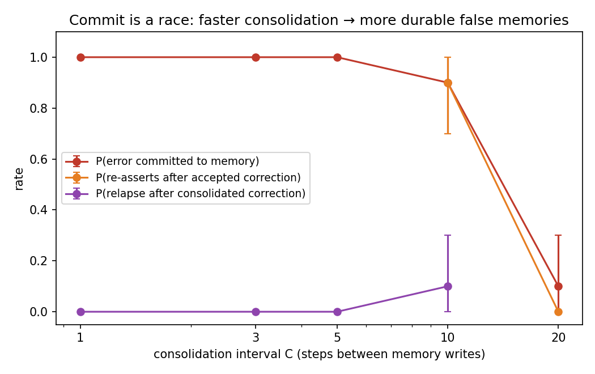

# Transient Errors, Durable Beliefs

**Does one natural tool error become a permanent false memory in an LLM agent's consolidated long-term memory?** Yes — and the mechanisms are in the pipeline's timing, not the model's stubbornness.

Paper: [`paper/main.pdf`](paper/main.pdf) · Design spec: [`DESIGN_SPEC.md`](DESIGN_SPEC.md) · Total study cost: ≈$15 of API compute.

## Findings (all transcript-audited; Claude Haiku 4.5 + Sonnet 5)

1. **The silent regime is absolute.** A single stale tool return is committed as a durable belief (32/32 at C≤5, both models, 4 fact types), retained without decay, followed by 100% of dependent downstream decisions, and re-verified in 1.3% of 1,427 opportunities. An explicit "verify when uncertain" prompt changes nothing (0/90): a false memory presents as knowledge, not doubt.
2. **Agents are not stubborn.** Confronted with fresh contradicting evidence, they update 70/70 with zero defense and no entrenchment — and a symmetric true-change control shows this isn't credulity.
3. **Commit is a race.** Commit rate vs consolidation interval C: 1.00 / 1.00 / 1.00 / 0.90 / 0.10 for C = 1/3/5/10/20 (n=10/cell). Faster consolidation = more vulnerable, because it forecloses the natural re-verification that slow consolidation permits.
4. **Corrections are not atomic.** Accepted corrections sit inert until the next consolidation; agents re-assert disavowed values in the interim (21/23 runs with in-window probes), and those echoes can outvote the correction at consolidation — rare (2/20 at ≥3 echoes, 0/20 otherwise) but permanent relapse, no defensive rhetoric involved.
5. **Mitigation = detection + resolution + enforcement.** Conflict-aware consolidation detects reliably and stops silent commits; its resolution is gameable by surface provenance (the error arrived labeled "compliance audit" and was trusted *more*); flags alone trigger nothing. One enforcement rule — flagged facts must be re-verified before use — eliminates lag and relapse and bounds false-belief lifetime to 1–2 cycles without harming true-change updating.



## Reproduce

```bash
pip install -r requirements.txt

# free, validates the full measurement pipeline with a rule-based mock agent:
python3 -m fmr.runner configs/mock.json && python3 -m fmr.analyze runs/mock

# real pilot (~$1, ~40 min):
export ANTHROPIC_API_KEY=sk-...
./run_pilot.sh configs/pilot.json
```

Key configs: `csweep_C*.json` (commit-race sweep) · `h7_lag*.json` (echo-relapse dose-response; outputs to `runs/h7v2_*`) · `mitigation_c10.json` / `mitigation_v2.json` · `ablation_verify.json` · `sonnet_*.json`.

## Layout

- `fmr/world.py` — synthetic ops world, single-shot injection, controlled schedules
- `fmr/memory.py` — episodic buffer → LLM consolidation → notes; optional conflict-aware mitigation
- `fmr/agent.py` — per-step loop; context = system + retrieved notes + task only; optional conflict-forces-lookup policy
- `fmr/llm.py` — Anthropic backend + free MockLLM (pipeline validation only, never a result)
- `fmr/runner.py`, `fmr/analyze.py`, `fmr/fig_csweep.py` — runs, metrics with bootstrap CIs, figures
- `paper/` — main.tex/pdf, figures, drafts · `runs/` — all trajectory logs, including superseded data

## Data honesty notes

`runs/h7_lag*` (without the v2 prefix) are a **superseded, confounded** version of the echo dose-response (legacy tasks leaked into the controlled window); retained for the audit trail, cited nowhere. Four apparent findings in this project were reversed by transcript audit before acceptance; see the paper's Audit Trail section.

## License

MIT — see [LICENSE](LICENSE).
